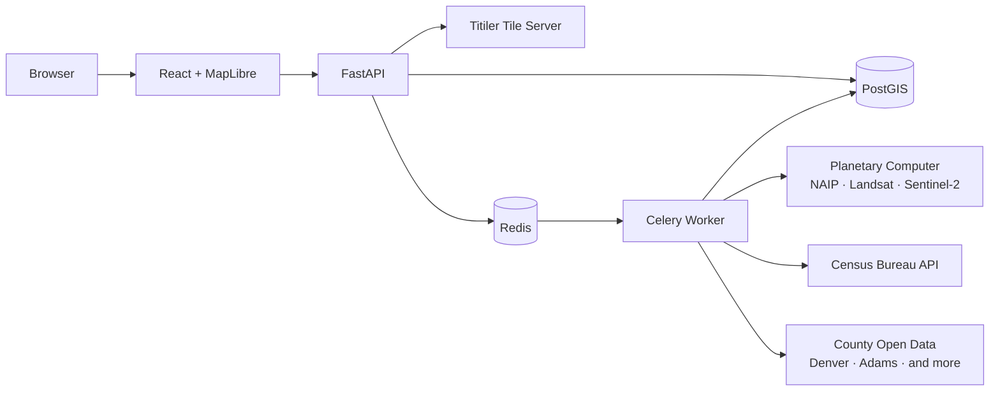

# 🗺️ Plotline

**See how any place has changed.**

Plotline turns a US address into a rich, scrollable timeline (decades of satellite and aerial imagery, neighborhood demographics, and property records) so you can watch a place evolve from farmland to subdivision, warehouse district to condo corridor, or quiet town to sprawling suburb.


> **📍 Try it live**: *COMING SOON*
>
> Or run it locally — one command, see [Getting Started](#getting-started) below.

---

## What it does

Enter any US address. Plotline geocodes it, then searches public archives for every piece of history it can find — aerial photos from NAIP going back to 2003, Landsat satellite imagery reaching into the 1980s, Census demographic data across four decades, and county property sales and building permits. It stitches all of it into a single interactive timeline synced to a zoomable map, so you can scrub through time and watch the landscape change while the data tells you who lived there, what they paid, and what they built.


## Featured Examples

These locations are pre-loaded and ready to explore:

**🏘️ Green Valley Ranch, Denver** — Prairie to planned community in 15 years. NAIP imagery from 2003 shows empty grassland; by 2023 it's a dense subdivision with schools and parks. Census population grew over 4,000%.

**🏗️ RiNo District, Denver** — Industrial warehouses to breweries and condos. Demolition and new construction permits cluster between 2014–2020. Median home values tripled in a decade.

**✈️ Stapleton/Central Park** — Airport to neighborhood --- the largest urban redevelopment in US history.

---

## Architecture



A user enters an address. The API geocodes it via the Census Geocoder, stores the parcel in PostGIS, and kicks off a Celery task. The worker searches the Microsoft Planetary Computer STAC API for historical imagery, pulls demographic snapshots from the Census Bureau, and fetches property records from county open data portals. Titiler dynamically serves Cloud-Optimized GeoTIFF tiles so imagery is zoomable at full resolution. The frontend renders everything on a MapLibre map with a synchronized timeline, demographic charts, and property event cards.

## Tech Stack

| Layer | Technology | Why |
|-------|-----------|-----|
| **Frontend** | React 18, TypeScript, Vite | Type-safe SPA with fast dev iteration |
| **Map** | MapLibre GL JS | GPU-accelerated map rendering, COG tile support, open-source |
| **Charts** | Recharts | Lightweight, composable, React-native charting |
| **Animation** | Framer Motion | Smooth timeline transitions and layout animations |
| **Styling** | Tailwind CSS | Utility-first, dark theme, consistent design system |
| **API** | FastAPI (Python 3.12) | Async-capable, Pydantic validation, OpenAPI docs for free |
| **Database** | PostgreSQL 16 + PostGIS 3.4 | Spatial indexes, geometry operations, industry standard for geospatial |
| **Migrations** | Alembic | Versioned schema changes, repeatable deployments |
| **Task Queue** | Celery + Redis | Async imagery/census/property fetching with per-source progress tracking |
| **Tile Server** | Titiler | Dynamic COG rendering — full-resolution zoom without downloading entire GeoTIFFs |
| **Deployment** | Fly.io | Auto-stop machines for API, worker, and tile server |

## Data Sources

| Source | What it provides | Coverage |
|--------|-----------------|----------|
| [NAIP](https://planetarycomputer.microsoft.com/dataset/naip) via Planetary Computer | Aerial imagery, ~1m resolution | Continental US, 2003–present |
| [Landsat](https://planetarycomputer.microsoft.com/dataset/landsat-c2-l2) via Planetary Computer | Satellite imagery, 30m resolution | Global, 1984–present |
| [Sentinel-2](https://planetarycomputer.microsoft.com/dataset/sentinel-2-l2a) via Planetary Computer | Satellite imagery, 10m resolution | Global, 2015–present |
| [US Census Bureau](https://www.census.gov/data/developers/data-sets.html) | Population, income, housing, demographics by tract | Nationwide, 1990–2023 |
| [Census Geocoder](https://geocoding.geo.census.gov/geocoder/) | Address geocoding + census tract lookup | Nationwide |
| County Open Data (Socrata) | Property sales, building permits | Denver metro — see [SUPPORTED_COUNTIES.md](SUPPORTED_COUNTIES.md) |

---

## Getting Started

### Prerequisites

- Docker and Docker Compose
- A free Census Bureau API key ([register here](https://api.census.gov/data/key_signup.html))

### Setup

```bash
# Clone the repo
git clone https://github.com/log0s/plotline.git
cd plotline

# Configure environment
cp .env.example .env
# Edit .env and add your CENSUS_API_KEY

# Start everything
docker compose up
```

That's it. Open [http://localhost:5173](http://localhost:5173).

The first startup takes a minute or two while Docker pulls images and runs migrations. Subsequent starts are fast.

### Seed featured locations (optional)

```bash
make featured
```

This pre-computes timelines for the featured example locations so they load instantly.

### Other useful commands

```bash
make up          # Start all services (detached)
make down        # Stop all services
make logs        # Tail logs from all services
make migrate     # Run database migrations
make test        # Run backend tests
make lint        # Lint backend (ruff + mypy)
make clean       # Stop services and remove volumes
```

---

## Project Structure

```
plotline/
├── docker-compose.yml          # Full local stack: PostGIS, Redis, API, Worker, Titiler, Frontend
├── fly.toml                    # API deployment config
├── fly.worker.toml             # Worker deployment config
├── fly.titiler.toml            # Tile server deployment config
├── Makefile
├── .env.example
│
├── backend/
│   ├── Dockerfile
│   ├── pyproject.toml
│   ├── alembic/                # Database migrations
│   ├── app/
│   │   ├── main.py             # FastAPI app factory
│   │   ├── config.py           # Environment-based settings (pydantic-settings)
│   │   ├── models/             # SQLAlchemy + GeoAlchemy2 models
│   │   ├── schemas/            # Pydantic request/response schemas
│   │   ├── api/v1/             # Route handlers: geocode, parcels, imagery, demographics, events
│   │   ├── services/           # Business logic: geocoder, STAC client, Census client, county adapters
│   │   └── tasks/              # Celery tasks: imagery fetch, census fetch, property fetch
│   └── tests/
│
├── frontend/
│   ├── Dockerfile
│   ├── package.json
│   ├── vite.config.ts
│   └── src/
│       ├── components/         # SearchBar, MapView, Timeline, DemographicsPanel, CompareView
│       ├── hooks/              # useTimeline, useGeocoder, useDemographics, usePropertyEvents
│       ├── api/                # Typed API client
│       └── types/
│
├── scripts/
│   ├── seed.py                 # Seed example parcels
│   └── seed_featured.py        # Pre-compute featured location timelines
│
├── DEVELOPMENT.md              # Claude Code build process journal
└── SUPPORTED_COUNTIES.md       # County data source documentation
```

---

## Development

This project was built using [Claude Code](https://docs.anthropic.com/en/docs/build-with-claude/claude-code) as the primary development tool — from initial scaffolding through deployment. See **[DEVELOPMENT.md](DEVELOPMENT.md)** for a detailed, honest account of the process: which prompts worked, where Claude Code excelled, where I had to intervene, and what I learned about AI-assisted development as a senior engineer.

---

## Known Limitations

**County data coverage is limited.** Property sales and permits are currently available for Denver, Adams, DC, Santa Clara, and New York counties. The adapter architecture makes adding new counties straightforward, but each county's data portal has different schemas, field names, and API quirks that require manual integration work.

**Address matching is imperfect.** County records use inconsistent address formats. The app normalizes and fuzzy-matches, but some parcels won't find their property history, especially condos with unit numbers or addresses with unusual formatting.

**Census tract boundaries change across decades.** The demographic data for a given parcel uses the current tract boundary for ACS data and the contemporaneous boundary for decennial data. In rapidly growing areas where tracts have been split, the 1990 data may represent a much larger geographic area than the 2020 data. The UI notes this, but doesn't attempt cross-decade tract normalization.

**Income and home values are nominal dollars.** The demographic charts show dollar values as reported in each year's Census data, not adjusted for inflation. A median income of $40,000 in 1990 is not directly comparable to $75,000 in 2023. This is noted in the UI.

**Imagery availability varies by location.** NAIP coverage starts around 2003 and is limited to the continental US. Landsat goes back to 1984 but at 30m resolution — you can see land use changes but not individual buildings. Very rural areas may have sparse NAIP coverage. Areas outside the US have no NAIP or Census data.

---

## License

MIT
